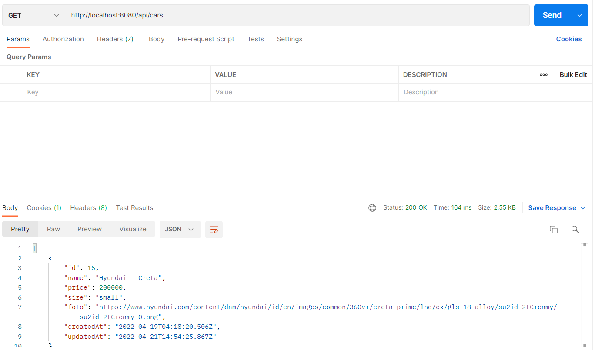
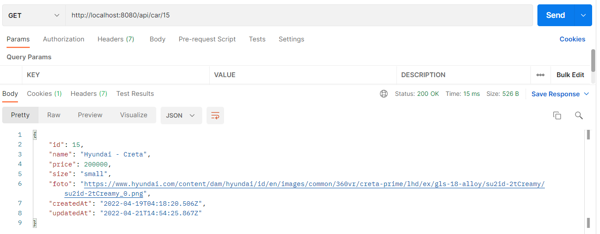
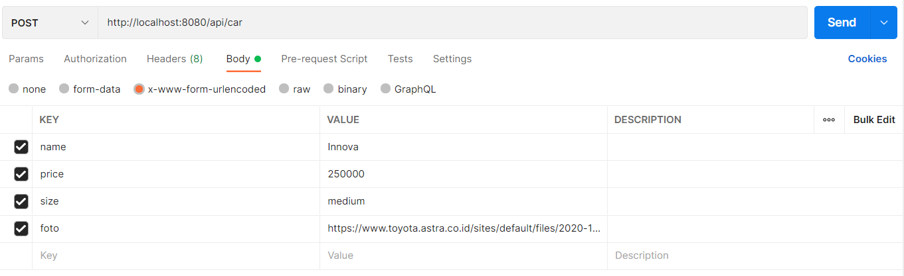
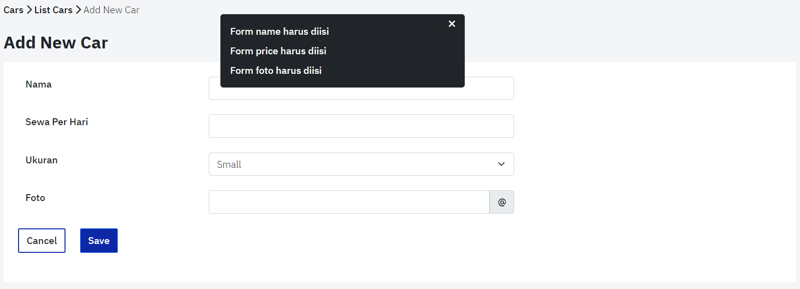
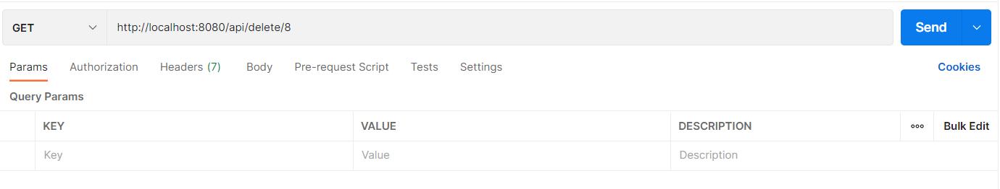
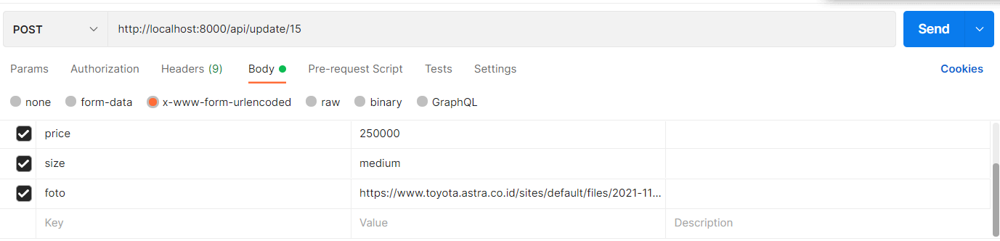
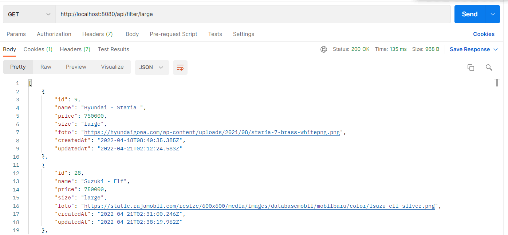

# Binar Challange 5 - Car Rent System

---

This Challange made by Dimas Aulia Fachrudin.

## Feature

- Create API for insert new car data
- Create API for update car data
- Create API for delete car data
- Create API for show all cars data
- Create view to show all cars
- Create form to add or edit a car data

## How to install

1. install all required dependencies with command

```properties
    yarn install
```

2. Create the database with command below

```properties
    yarn sequelize db:create
```

3. Migrate all data in database with command bellow

```properties
    yarn sequelize db:migrate
```

4. Run the server.

```properties
    yarn dev
```

There are several servers with different functions, the first server is accessed with `yarn start`, the basic server needs to be restarted every time. `yarn dev`, a server that automatically restarts if there is a modification to the \*.js file and a `yarn watch` server that will restart when there are changes to a static file or a file in the public directory.

## Database Structure

| Column    | Type                     |
| --------- | ------------------------ |
| id        | integer                  |
| name      | character(255)           |
| price     | float                    |
| size      | character(255)           |
| foto      | character(255)           |
| createdAt | timestamp with time zone |
| updatedAt | timestamp with time zone |

## API

### List API

To show all data in database you can easely use this link `/api/cars`. You can see the code in [this file](app/api/controllers/controller.js) at line 3.



### Get API

Get api's job is to return specific data based on the id data in the url. You can go to this url `/api/car/:id`. The code you can see at line 74 at [this file](app/api/controllers/controller.js).



### Create API

You can see the code in [this file](app/api/controllers/controller.js) at line 12. How to use this api. Request body must contain name, price, size, foto. An example can be seen below. You can accses the api in this url `/api/car` with POST method.



If one of them is empty, the user will be redirected to the add page with a flash message to warn the user that each form must be filled in.



### Delete API

The delete api is responsible for deleting data based on the id parameter given in the url. You can see the code in [this file](app/api/controllers/controller.js) at line 63. This action work in GET method, the url is `/api/delete/:id`



### Update API

The update api is in charge of updating data based on the id parameter given in the url. You can see the code in [this file](app/api/controllers/controller.js) at line 84. This action available at `/api/update/:id` with POST method.



The update API requires the same request body as the Create API, and has the same behavior. In the API update, if the data is not found, the user will be redirected to the home page.

### Filter API

The filter API is tasked with returning based on the size of the parameter. This action runs with the GET method. You can see the code in [this file](app/api/controllers/controller.js) at line 134. The filter API is tasked with returning car data .that matches the size given in the url.


